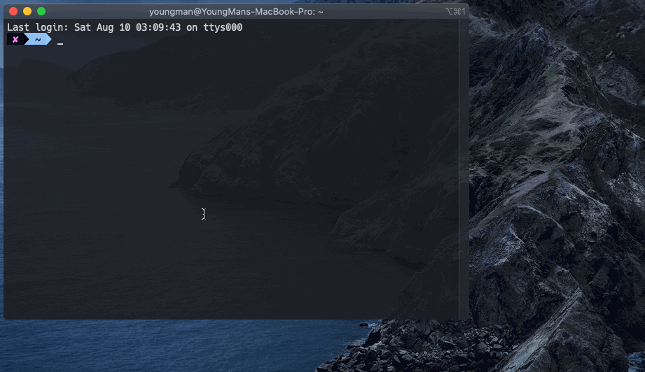

# What is this ?

This is a theme package that provides terminal embellishment for mac users. With iterm2, you can quickly configure a simple but beautiful terminal interface.

In fact, this theme package comes from [oh-my-zsh](https://github.com/robbyrussell/oh-my-zsh), which also contains other open source components. We just packaged it for installation. Thanks to the original authors of oh-my-zsh and other open source community project contributors. Give us such a good tool.



# Quick start

1. Install Homebrew ( Paste that in a macOS Terminal prompt )
   ```
   /usr/bin/ruby -e "$(curl -fsSL https://raw.githubusercontent.com/Homebrew/install/master/install)"
   ```
2. Install the necessary font files  (!Required, use brew command)
   ```
   brew tap homebrew/cask-fonts
   brew cask install font-hack-nerd-font
   ```
3. Clone this repo, and into folder.
   ```
   git clone https://github.com/spring-bu/zshconfig.git
   cd zshconfig
   ```
4. Install script.
   ```
   ./install.sh
   ```
5. Open you iterm2, --> `Preferences` --> `Profiles` --> `Colors` --> click `Colors Presets` --> `Import` --> Select iterm2.itermcolors file. --> Choose your favorite theme color(I prefer atom) --> Then set as default.
6. Navigate to the `text` tag,we need to set the font used by iterm2. setup font use `Hack Nerd Font`, finally, after setting up, re-open iterm2 and enjoy it.

## License

This package released under the [Apache 2.0](LICENSE).
